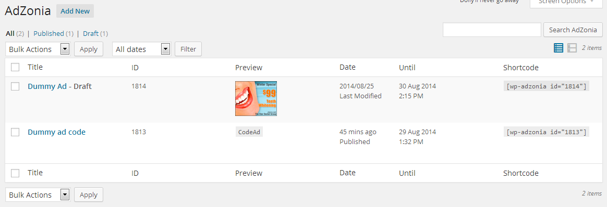
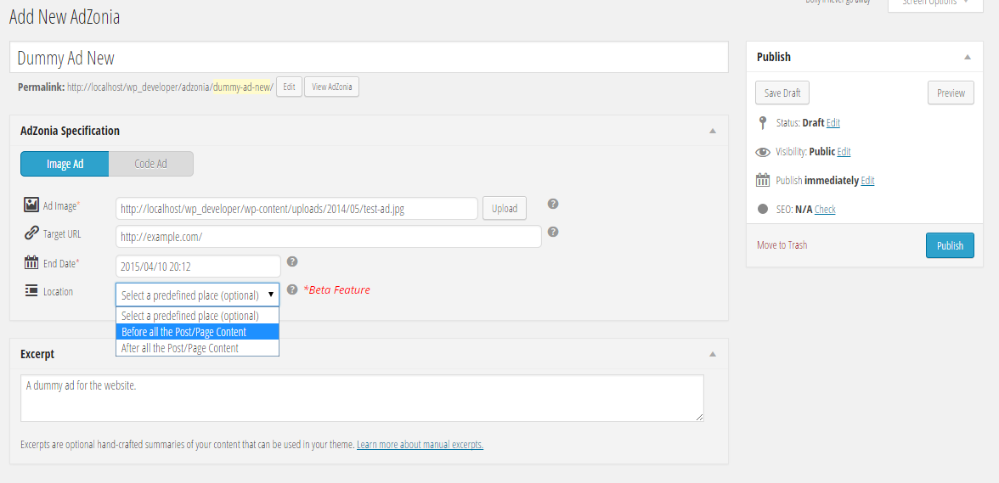

##WP AdZonia##
WordPress Advertisement Manager Plugin 
Version 1.2 
<strong>Developer:</strong> Mayeenul Islam (@mayeenulislam)

A simplest and easiest Advertisement Manager Plugin for WordPress sites, and most astonishingly - it's in <strong>WordPress way</strong>. You can call the advertisements into your template using a simple function: <code><?php if ( function_exists( "show_adzonia" )  ) show_adzonia( # ); ?></code>, or you can call the ad in anywhere using the shortcode: <code>[wp-adzonia id="#"]</code>, or you can use the AdZonia widget into any widget-enabled area of your site.

###Screenshots###

<em>List of advertisements</em>

<em>Adding new advertisement</em>

###Credits###
Thanks to my plugin guru Ms. Tahmina Aktar for the appreciation and support from the very beginning.
Thanks also to Shimul Islam, Tareq Hasan, Sisir Kanti Adhikari. And thanks also to Franz Josef Kaiser, Stephen Harris, Tom J Nowell, Andrey Savchenko (Rarst), and Thomas Scholz (Toscho) for their remote support and assistance. I won't ever forget their love and teaching. Thanks a lot and jazakALLAH

###Change Log###
####1.2####
* Completely Translation-ready
* Bengali (<em>Bangla</em>) translations
* CSS improvements
* Settings Page
* Basic Instructions Manual
* Fallback jQuery installer
* Detailed instructions in Wiki
* Minor visual fixes
* Reorganization of files
* Optional Front-end CSS

####1.1###
* Incorporated AdZonia Widget
* Minor visual fixes
* Reorganized files

####1.0###
* Discarded the custom table
* Initiated Custom Post Type (CPT)
* Initiated Custom Meta Fields
* Two ad types only
* Table Columns are added and organized
* Reorganized files

####0.1####
* Custom Table
* Media Uploader
* Different ad types